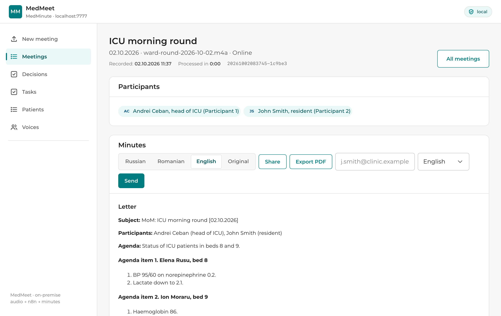

# MedMinute

**Meeting minutes for multilingual doctors' meetings — online or fully offline.**

[](LICENSE)


MedMinute records a doctors' meeting, transcribes it, works out by voice who was speaking, and
turns the conversation into finished minutes (MoM) in **Russian, Romanian and English**, plus
tables of **decisions, tasks, patients and prescriptions**. It is built for meetings where people
switch between Russian, Romanian and English, often within a single sentence.



## Features

- **Two modes.** *Online* uses OpenAI speech and language models and takes minutes. *Offline* runs
  Whisper, speaker separation and an LLM on the same machine: the recording never leaves it.
- **Verbatim transcript.** The text is assembled in code from short recognition windows. No model
  rewrites it, so nothing is paraphrased before it reaches the minutes.
- **Grounded minutes.** The prompts let the model restore garbled words but forbid inventing drugs,
  diagnoses, names or numbers. `tools/check-mom-grounded.js` checks every number and name against the transcript.
- **Voice IDs across meetings.** Each voice gets a stable `V-001`, `V-002`… Name it once and the
  person is recognised in every later meeting. Reference voices can be enrolled.
- **Structured output.** Decisions, tasks and prescriptions (drug, dose, route, quote, confidence)
  are stored in SQLite and searchable across all meetings.
- **Delivery.** PDF export, email to participants (manually or automatically when processing ends),
  and a share button.
- **Built-in recorder.** Record the meeting straight from the browser.

| | Online | Offline |
|---|---|---|
| Speech recognition | OpenAI `gpt-4o-transcribe` | Whisper large-v3-turbo (local) |
| Who spoke | OpenAI `gpt-4o-transcribe-diarize` | VAD + ECAPA/WeSpeaker (local) |
| Minutes and tables | OpenAI `gpt-4.1` | `qwen3:8b` via Ollama (local) |
| Data leaves the machine | yes, to OpenAI | no |
| Speed | minutes | slow, depends on hardware |

## How it works

```
browser ──upload/record──► site :7777 (Node.js + SQLite) ──webhook──► n8n :5678
                                 ▲                                        │
                                 └──── results, piece by piece ───────────┘
                                                                          │
                     online: ffmpeg + OpenAI      offline: ASR service :7778 + Ollama :11434
```

The site stores everything and serves the UI. n8n runs the processing pipeline. The local ASR
service does offline transcription and computes voice prints in both modes. Details are in
[docs/architecture.md](docs/architecture.md).

## Quick start

Requirements: Windows 10/11, Node.js ≥ 20, n8n, ffmpeg. For offline mode you also need
Python ≥ 3.10 and Ollama.

```bash
# 1. the website
cd site
npm ci
npm start                       # http://localhost:7777

# 2. n8n (n8n 2.x needs these two variables, see the setup guide)
NODES_EXCLUDE='[]' N8N_RESTRICT_FILE_ACCESS_TO='C:/medminute/audio' n8n start
#    then import n8n/*.json, attach the OpenAI / SMTP credentials and activate the workflows

# 3. offline mode only
pip install -r site/asr/requirements.txt
python site/asr/download-models.py && python site/asr/download-voiceid.py
python site/asr/service.py      # http://127.0.0.1:7778
ollama pull qwen3:8b
```

The full guide covers folder layout, every setting, credentials, autostart, security and
troubleshooting: **[docs/setup.md](docs/setup.md)**.

## Repository layout

```
site/                 website + API (Node.js, no framework, no build step)
  server.js           HTTP server, API, n8n callbacks, PDF, email, voice ID
  db.js               SQLite schema and queries, cross-meeting voice registry
  public/             frontend (app.js, recorder.js, app.css, icons, font)
  asr/                local ASR service (Whisper, VAD, speaker embeddings) + model downloaders
  tools/              operational scripts, validate.js (CI), history/ (pipeline tuning log)
n8n/                  workflow exports: online, offline, mailing
docs/                 setup guide, architecture
```

## Development

```bash
cd site
npm test      # JS syntax + n8n workflow integrity (node references, connections, code fragments)
```

CI runs these checks, a server smoke test and a Python compile check on every push. See
[CONTRIBUTING.md](CONTRIBUTING.md).

## Privacy and security

Recordings, transcripts and the database contain patients' health data. The website has **no
authentication** and online mode sends audio to OpenAI. Read [SECURITY.md](SECURITY.md) before you deploy.

## Roadmap

1. Enroll reference voices of the real staff, so names appear at once instead of "Participant N".
2. When the PDF cannot be built, the email currently falls back to a `.md` attachment.
3. Local speaker separation tends to merge everyone into one cluster on long recordings.
4. Check and raise `num_ctx` for `qwen3:8b`: long meetings may exceed the context.

## License

[MIT](LICENSE). Third-party components and models are listed in
[THIRD_PARTY_NOTICES.md](THIRD_PARTY_NOTICES.md). n8n itself is under the Sustainable Use License.
